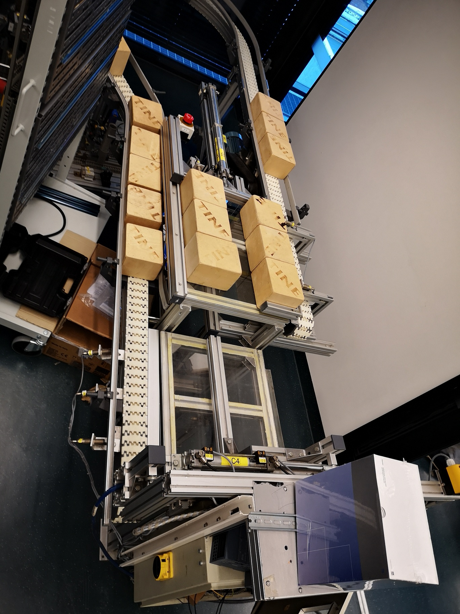
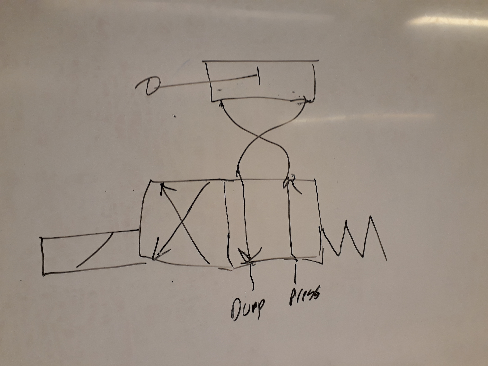
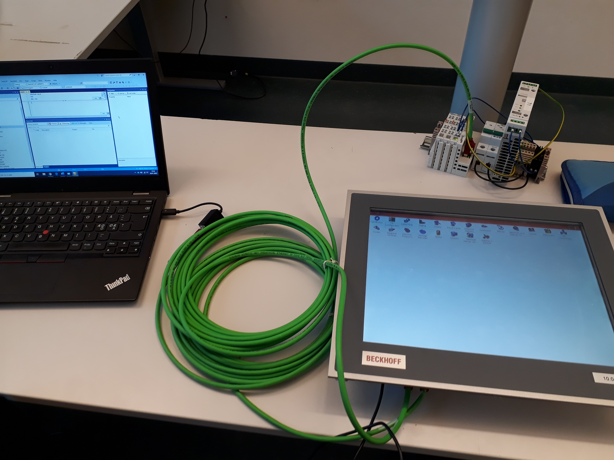

# Transportbånd

- ##  Introduksjon
I dette prosjektet er målet å få transportbåndet (på lageret mellom 1ELR og 2ELR) i gang. Prosjektet innvolverer en blanding av pneumatikk, og elektronikk. Målet er at båndet skal være automatisk og selvstyrt, vi har sensorer og de fleste andre deler som er nødvendige for at båndet skal fungere. 
- ## Fremgangsplan
  - Få transportbåndet i gang ✔️
  - Få luft i sylinderne ✔️
  - Finne ut hva som mangler av deler og lignende
  - Lage alle tegninger til transportbåndet
  - Få koblet opp sensorene
  - Få koblet ferdig skap 2
  - Lage PLS program
  - Teste anlegget 

- ##  Oversikt
Transportbåndet fungerer fint med manuell styring. Når man først åpner ventilene tar det 1-2 minutter før man kan dytte klossene ved hjelp av pneumatikken, fordi ventilene tar litt tid for til å fylles med luft. Startposisjon for ventilene er når de røde bryterne står vertikalt. Da er luften stengt. På sylinderne står det hvilken rekkefølge man skal vri på bryterne (steg 1, 2, 3,...). 

Nå skal transportbåndet styres ved hjelp av PLS og kontaktorer. Last ned TwinCat 3 Engineering (XAE): https://www.beckhoff.com/twincat3/
og se tutorial på youtube. Vi har satt opp en testrigg til I/O modul sånn at vi kan koble den til pcen. I tillegg til dette må vi finne ut hvilke sensorer det er vi har på transportbåndet, slik at vi kan begynne å finne ut hva som må gjøres for å få de i gang.

- ##  Intro til PLS program
PLS progammet heter TwinCat 3, og er vanskeligere å bruke enn logosoft. Derfor må man investere en del tid for å lære seg å bruke programmet. Det er problemer med tilkoblinger mellom PC-en og modulen. 

 - ## ventil symbol 
 
 det lille rektangelet nederst til venstre med en skrå strek. den rektangelen representerer spolen. en kabel kobles vanelig vis i toppen av rekktngelen og i bunnen. når spolen er på kan luften gå gjennom ventilen og sendes videre til pnumatikk sylynderen på toppen av tegningen.. som dytter da sylynderen på toppen. og dytter den tilbake hvis den andre firkanten med kretsen byttes. den andre firkanten med kretsen kan bytes. vis man vrir på bryteren. det er en sik sak form/fjær nede i høyere hjørne. det er en fjær som dytter tilbake firkantene. og får ventilen til å gå tilbake til sin vanelige tilstand. pilene i firkanten sier hvor luften går. den går fra press til domp. da vil trykket fra press gå gjennom til den ene siden og dytte pnumatikk sylynderen en vei. og når den andre firkanten blir slåt ut av fjæren så vil pnumatikk sylinderen få trykk andre veien og gå tilbake til sin orginale tilstand. 

 
 
 - ## codesys
 codesys bruker vi nå isteden for twincat 3. Fordi man ikke trenger bechoff skjermen. https://store.codesys.com/ link. vi hadde problemer med bechoff skjermen. med codesys så kan vi bruke pc uten bechoff skjermen, men du skal fortsatt bruke I/O modulen som er festet til bechoff skjermen.  
 
 
 - ## pc, bechoff skjerm og I/O modul  

 
 
 
 

 
