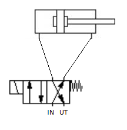

# Transportbånd

##  Introduksjon
I dette prosjektet er målet å få transportbåndet (på lageret mellom 1ELR og 2ELR) i gang. Prosjektet innvolverer en blanding av pneumatikk, og elektronikk. Målet er at båndet skal være automatisk og selvstyrt, vi har sensorer og de fleste andre deler som er nødvendige for at båndet skal fungere. 

##  Oversikt
Transportbåndet fungerer fint med manuell styring. Når man først åpner ventilene tar det 1-2 minutter før man kan dytte klossene ved hjelp av pneumatikken, fordi ventilene tar litt tid for til å fylles med luft. Startposisjon for ventilene er når de røde bryterne står vertikalt. Da er luften stengt. På sylinderne står det hvilken rekkefølge man skal vri på bryterne (steg 1, 2, 3,...). 

Nå skal transportbåndet styres ved hjelp av PLS og kontaktorer. I hjørnet i klasserommet står det en industri PC med en testrigg til I/O modul som kan lekes med. For å komme i gang følg denne tutorialen: https://infosys.beckhoff.com/english.php?content=../content/1033/tc3_plc_intro/36028799544005771.html&id=
## Fremgangsplan
Det ligger et projeskt i repoet med roadmappet. Her kan du legge til og flytte på oppgaver når de blir gjort/gjøres.

##  Intro til PLS program
PLS progammet heter TwinCat 3, og er vanskeligere å bruke enn logosoft. Derfor må man investere en del tid for å lære seg å bruke programmet. Det er problemer med tilkoblinger mellom PC-en og modulen, så derfor bruker vi industi PC'en til James.

## ventil symbol 
  
 
 
 
Det lille rektangelet nederst til venstre med en skrå strek. den rektangelen representerer spolen. en kabel kobles vanelig vis i toppen av rekktngelen og i bunnen. når spolen er på kan luften gå gjennom ventilen og sendes videre til pnumatikk sylynderen på toppen av tegningen. som dytter da sylynderen på toppen. og dytter den tilbake hvis den andre firkanten med kretsen byttes. den andre firkanten med kretsen kan bytes. vis man vrir på bryteren på ventilen. det er en sik sak form/fjær nede i høyere hjørne. det er en fjær som dytter tilbake firkantene med krets. og får ventilen til å gå tilbake til sin vanelige tilstand. pilene i firkanten sier hvor luften går. den går fra press til domp. da vil trykket fra press gå gjennom til den ene siden og dytte pnumatikk sylynderen en vei. og når den andre firkanten blir slåt ut av fjæren så vil pnumatikk sylinderen få trykk andre veien og gå tilbake til sin orginale tilstand. 
 
 
 
 ## pc, bechoff skjerm og I/O modul
 
 
